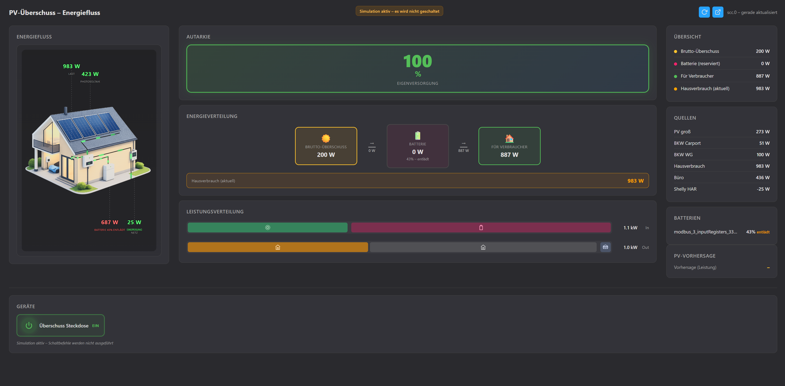

# ioBroker SCC (Self-Consumption Charging)

**Deutsch** | [English](README.en.md)

[](https://www.npmjs.com/package/iobroker.scc)
[](https://iobroker.live/badges/scc-installed)

**SCC** steht für **Self-Consumption Charging**: Eigenverbrauch steuern – zuerst Batterien laden, dann Geräte mit PV-Überschuss schalten, Rest ins Netz.

**Hinweis:** Dieser Adapter befindet sich in **Entwicklung**. Es wird **keine Haftung** für die Funktionsfähigkeit, Schäden oder Folgen der Nutzung übernommen. Nutzung auf eigenes Risiko.

---

## Beschreibung

Dieser ioBroker-Adapter berechnet den **PV-Überschuss** aus konfigurierbaren Quellen (z. B. Shelly Pro 3 EM, Wechselrichter, Zähler), bindet **Batterien** (SoC, Lade-/Entladeleistung) ein und schaltet **Geräte/Steckdosen** abhängig vom nach Batterie-Ladung verbleibenden Überschuss. Die Priorität ist konfigurierbar: **Batterie zuerst** (Standard) oder **Geräte zuerst**.

### Kernfunktionen

- **Quellen:** Mehrere Quellen mit Typen Erzeugung, Verbrauch, Netzleistung, Einspeisung – flexibel kombinierbar (z. B. Shelly am Hausanschluss als Netzleistung).
- **Batterien:** Mehrere Speicher mit SoC, optional Lade-/Entladeleistung; Ziel-SoC pro Batterie; Reservierung für Ladung wird vom „für Verbraucher verfügbar“ abgezogen (bei Priorität „Batterie zuerst“).
- **Regeln:** Schwellwert-basierte Schaltung von Geräten (EIN/AUS ab Watt), Hysterese, Min.-Dauer, Verzögerung.
- **States:** `surplus.powerW`, `surplus.availableForDevicesW`, `batteries.powerReservedW`, `consumption.totalW`, `grid.consumptionW` / `grid.feedInW`, `autarky.percent` usw. – für VIS, Dashboards und Skripte.
- **Admin:** Konfiguration per JSON-UI; **Flow-Tab** mit grafischer Energiefluss-Ansicht (Haus, PV, Batterie, Netz, Werte in Echtzeit).

### Abkürzung SCC

**SCC = Self-Consumption Charging** (Eigenverbrauch & Laden): Der Fokus liegt darauf, den Solarüberschuss zuerst für Speicherladung und dann für Verbraucher zu nutzen – typisch für PV-Anlagen mit Batterie und steuerbaren Lasten (WP, Steckdosen).

---

## Installation

Über ioBroker Admin: **Adapter** → **SCC** (PV-Überschuss-Steuerung) installieren.  
Oder per CLI:

```bash
iobroker add scc
```

**Node.js** mindestens 18.x.

---

## Konfiguration

- **Quellen:** Datenpunkte mit Typ (Erzeugung, Verbrauch, Netzleistung, Einspeisung). Z. B. ein Shelly Pro 3 EM am Hausanschluss als **eine** Quelle „Netzleistung“ (negativ = Einspeisung).
- **Batterien:** Pro Speicher SoC-State (%), optional Lade-/Entlade-State (W), Ziel-SoC, Name.
- **Überschuss-Priorität:** „Batterie zuerst“ (Standard) oder „Geräte zuerst“.
- **Regeln:** Pro Gerät Ziel-State (z. B. Shelly-Steckdose), **Geräteleistung (W)** (typ. Verbrauch), Schwellwert EIN/AUS (W), Hysterese, Min.-Dauer, Verzögerung. **EIN ab** sollte ≥ Geräteleistung + Puffer sein (z. B. Gerät 2000 W → EIN ab 2200 W), damit beim Einschalten kein Netz-/Batteriebezug entsteht; bei gesetzter Geräteleistung schaltet EIN nur, wenn „für Verbraucher verfügbar“ ≥ max(EIN ab, Geräteleistung).
- **Optionen:** Schwellwert „Überschuss an“, Pauschale Batterie-Reserve (W), PV-Vorhersage (optional), Hausverbrauch aus Bilanz berechnen (optional).

Details und Datenmodell siehe [CONCEPT.md](CONCEPT.md).

---

## Wichtige States (Beispiele)

| State | Beschreibung |
|-------|--------------|
| `surplus.powerW` | Brutto-Überschuss (W) |
| `surplus.availableForDevicesW` | Für Verbraucher verfügbar (W), nach Batterie-Reserve |
| `surplus.feedInW` | Einspeisung (W) |
| `batteries.powerReservedW` | Für Batterieladung reservierte Leistung (W) |
| `batteries.allCharged` | Alle Batterien ≥ Ziel-SoC |
| `consumption.totalW` | Hausverbrauch gesamt (W) |
| `grid.consumptionW` / `grid.feedInW` | Netzbezug / Netzeinspeisung (W) |
| `autarky.percent` | Autarkie (%) |
| `rules.<id>.state` | Gerät ein/aus (boolean) |

---

## Flow-Tab

Unter **Adapter-Instanz → Tab „Flow“** gibt es eine grafische Ansicht:



- Haus-Diagramm mit PV, Batterie, Netz, Hausverbrauch
- Animierte Energiefluss-Linien (grün/rot nach Logik)
- Live-Werte: Photovoltaik, Last, Batterie, Netz (Einspeisung/Bezug)
- Autarkie, Energieverteilung (Brutto → Batterie → Verbraucher), Leistungsverteilung, Übersicht, Quellen, Batterien, Geräte, PV-Vorhersage

Die Daten kommen aus den Adapter-States; bei fehlender Verbindung (z. B. in manchen Admin-Umgebungen) wird ein Hinweis angezeigt.

- **Als Einzelseite öffnen:** Im Flow-Tab öffnet der Button „Als Einzelseite öffnen“ die Ansicht in einem neuen Fenster (z. B. für zweiten Bildschirm oder Vollbild).
- **Standalone (ohne Admin):** In der Adapter-Konfiguration kann ein **Standalone-Port** (z. B. 8095) gesetzt werden. Dann ist die Flow-Seite direkt unter `http://<ioBroker-Host>:<Port>/flow.html` erreichbar – ohne Admin-Login.

---

## Versionierung

Bei der Entwicklung von ioBroker wird **SemVer (Semantic Versioning)** verwendet ([semver.org](https://semver.org/)).

- **Version** steht in `package.json` und in `io-package.json` unter `common.version` – beide müssen **gleich** sein (`x.y.z`).
- **Major (x.0.0):** Inkompatible API- oder Konfigurationsänderungen.
- **Minor (0.x.0):** Neue Funktionen, abwärtskompatibel.
- **Patch (0.0.x):** Bugfixes, abwärtskompatibel.

### Automatische Synchronisation

Beim Anheben der Version mit **npm** wird `io-package.json` automatisch angepasst:

```bash
npm version patch   # 0.3.0 → 0.3.1
npm version minor   # 0.3.1 → 0.4.0
npm version major   # 0.4.0 → 1.0.0
```

Das Skript `scripts/sync-version.js` läuft im **version**-Lifecycle und überträgt die neue Version aus `package.json` nach `io-package.json`. Danach: Eintrag in `CHANGELOG.md` ergänzen und ggf. committen/taggen.

---

## Lizenz

MIT License. Siehe [LICENSE](LICENSE).

---

*Teile dieses Projekts wurden unter Nutzung von KI-Assistenten (z. B. für Code und Dokumentation) entwickelt.*
